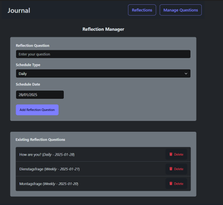

# Journal
Custom Desktop Journal zum erstellen von tagebuchähnlichen Einträgen und Reflexionsfragen.

## Inhaltsverzeichnis
1. [Einleitung](#einleitung)
2. [Client](#client)
3. [Server](#server)
4. [Datenbank](#datenbank)

## Einleitung
Bei der Desktopanwendung handelt sich um ein Journaling Programm. 
Der Benutzer hat die Möglichkeit seine persönlichen Gedanken, Erlebnissen, Reflexionen, ... in Tagebuchform festhalten. Außerdem können Reflexionsfragen festgelegt werden, die dem Benutzer in wiederholenden Abständen abgefragt werden. Der Benutzer kann diese Fragen an den eingestellten Tagen beantworten.

Sowohl die Antworten der Reflexionsfragen auch als auch die Journalingbeiträge sollen mithilfe einer Serveranwendung in einer Datenbank abgespeichert werden können und beim erneuten Aufrufen der Desktopanwendung an den jeweils gespeicherten Tagen angezeigt werden.

## Client

### Starten des Clients
Damit der Client gestartet werden kann, müssen zuerst die benötigten Packages installiert und die App gebuildet werden.
Dafür muss zuerst in das Journal/ Verzeichnis gewechselt und folgende commands ausgeführt werden:

`npm install i`

Electron funktioniert mit dem Build der React App, deshalb muss diese zuerst gebuildet werden. Dafür muss in das Verzeichnis der React App gewechselt, die Dependencies installed und die App gebuildet werden. Das funktioniert mit folgenden commands:

`cd app`

`npm install i`

`npm run build`

Jetzt kann mit den folgenden commands wieder in das Electron Verzeichnis gewechselt und Electron gestartet werden:

`cd ..`

`npm run start`

### Erklärung der Benutzeroberfläche

In diesem Screen wird mit "Journal Entry" angezeigt, an welchen Tagen ein Eintrag gemacht wurde und mit "Q" an welchen Tagen eine Reflektionsfrage beantwortet wurde. Mit dem Klick auf einen Tag öffnet sich der Journal Manager wo Journal Entries erstellt werden können.

Hier können Journal Einträge erstellt bzw. bearbeitet werden und mit "Save Journal Eintrag" gespeichert werden.

An diesem Tag beantworteten Reflektionsfragen können ebenso in diesem Screen gesehen werden.

In diesem Screen können Reflexionsfragen restellt werden
Und bereit erstellte Reflexionsfragen deaktiviert werden.

Hier können Reflexionsfragen, welche für den heutigen Tag vorgesehen sind, beantwortet werden.

### Generieren der Protofiles (muss nicht durchgeführt werden)
Da die Klassen bereits generiert wurden, muss dieser Schritt nicht mehr durchgeführt werden.
Dieser Schritt muss nur bei Änderunge der .proto Files durchgeführt werden.

` protoc --proto_path=<path_to_protofile> --js_out=import_style=commonjs,binary:C:/Users/micha/Desktop/Journal/app/src/proto --grpc-web_out=import_style=commonjs,mode=grpcwebtext:C:/Users/micha/Desktop/Journal/app/src/proto <path_to_protofile>`

## Server

### Starten des Servers
Damit eingegebene gespeichert bzw. gespeicherte Daten geladen werden können, muss der Server zuvor gestartet werden.
Dazu sollte das [Solution File](./JournalGrpcService/JournalGrpcService.sln) des gRPC Services geöffnet werden.
Um die benötigten NuGets zu laden, muss nach öffnen des C# Solution in Visual Studio folgender command eingegeben werden, damit die verwendeten NuGets gedownloadet werden:

`dotnet restore
`

Anschließend kann der Server ge rebuildet und gestartet werden, in dem man in der UI auf "Run" drückt.

### Generieren der Protofiles (muss nicht durchgeführt werden)
Da die Klassen bereits generiert wurden, muss dieser Schritt nicht mehr durchgeführt werden.
In C# ist es ausreichend das Projekt zu rebuilden falls die Protofiles geänder wurden, damit die Klassen der Protofiles generiert werden.

## Datenbank
Damit die Daten gespeichert werden können muss lokal eine Datenbank eingerichtet werden.
Im zuge der Projektarbeit wurde SQL Server verwendet, dieser kann unter folgendem Link gedownloadet werden.

https://www.microsoft.com/en-us/sql-server/sql-server-downloads

Als Datenbank Management Software wurde Microsoft SQL Server Management Studio (MSSMS) verwendet, das Programm kann unter folgenem Link gedownloadet werden:

https://learn.microsoft.com/en-us/sql/ssms/download-sql-server-management-studio-ssms?view=sql-server-ver16

Default mäßig sollte bereits eine "master database vorhanden sein.

Sollte defaultmäßig noch keine Datenbank namens "master" erstellt worden sein, muss nach der Installation eine Datenbank names "master" hinzugefügt werden.

Die funktioniert, indem man mit rechter Maustaste auf "Databases" -> "new Database ..." 

Anschließend kann mit "New Query" in der Menüleiste das Create Skript ausgeführt werden.
Achten Sie darauf, dass im Dropdown der Menüleiste die "master" Datenbank ausgewählt ist.

Jetzt kann folgendes [Create Skript](./CreateScript.sql) in das Query file kopiert. Jetzt muss auf "Execute" gedrückt werden, damit das Create Skript ausgeführt wird.

